# 📊 UTZSHOP ManageHub | Foundation of Information Systems (ISP500)

> A comprehensive business process analysis and information systems design project for UTZSHOP SDN BHD, a Malaysian retail chain specializing in mobile phone accessories.

---

## 📋 Table of Contents
- [Project Overview](#-project-overview)
- [Company Background](#-company-background)
- [Current Information Systems](#-current-information-systems)
- [Business Process Analysis](#-business-process-analysis)
- [Porter's Value Chain Analysis](#-porters-value-chain-analysis)
- [Porter's Five Forces Analysis](#-porters-five-forces-analysis)
- [Problem Statements](#-problem-statements)
- [Proposed Business Solution](#-proposed-business-solution)
- [System Demonstration](#-system-demonstration)
- [Lessons Learned](#-lessons-learned)
- [Team Members](#-team-members)
- [Repository Structure](#-repository-structure)

---

## 🎯 Project Overview

This project analyzes the business operations of **UTZSHOP SDN BHD** (Kedai Ustaz), a growing retail chain in Malaysia, and proposes a centralized information system to address operational inefficiencies. The analysis covers business processes, competitive positioning, and the design of an integrated management platform called **UTZSHOP ManageHub**.

### Key Focus Areas
| Area | Description |
|------|-------------|
| **Business Analysis** | Company background, operations, and current systems |
| **Process Mapping** | Flowcharts for 5 key business processes |
| **Strategic Analysis** | Porter's Value Chain and Five Forces models |
| **Problem Identification** | Current challenges and inefficiencies |
| **Solution Design** | UTZSHOP ManageHub application |
| **System Demonstration** | Interface screenshots and CRUD functionality |

---

## 🏢 Company Background

**UTZSHOP SDN BHD** (Kedai Ustaz) was founded by **Mohd Zailani** in 2015 as a single cell phone accessory store in Damansara, Selangor. Driven by his passion for technology and commitment to providing affordable, quality products, the business has experienced rapid growth.

### Key Statistics
| Metric | Value |
|--------|-------|
| **Founded** | 2015 |
| **Founder** | Mohd Zailani |
| **Branches (2024)** | 7 branches |
| **Locations** | Shah Alam (2), Damansara (3), Kuala Lumpur (2) |
| **Staff per Branch** | 20 employees |
| **Shifts** | 8:00 AM - 5:00 PM & 5:00 PM - 2:00 AM |

### Company Vision & Mission
- **Vision**: To become the preferred destination for high-quality, affordable cell phone accessories
- **Mission**: To offer a wide range of quality products paired with exceptional customer service

### Branch Location
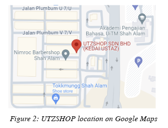

### Organizational Structure
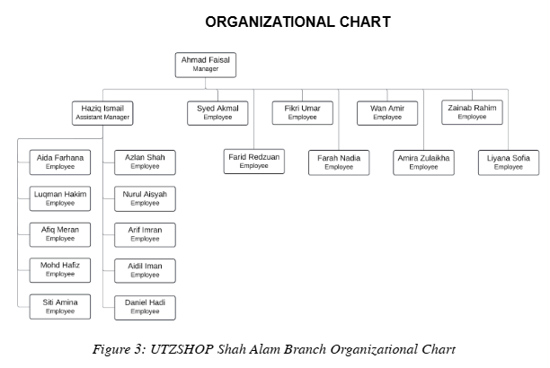

---

## 💻 Current Information Systems

Based on interviews with UTZSHOP employees **Syakir** (full-time) and **Faris** (part-time) on November 13, 2024, the company currently uses the following systems:

### Back-End Systems (Excel Spreadsheets)

| Function | Description |
|----------|-------------|
| **Inventory Management** | Stock level tracking and replenishment |
| **Staff Attendance** | Clock-in/out times, hours worked, leave balances |
| **Quality Control** | Tracking defective and returned items |
| **Data Storage** | Each branch maintains separate Excel files |

### Front-End Systems

| System | Purpose |
|--------|---------|
| **POS System** | Transaction handling, automatic inventory updates, sales reporting |
| **TikTok** | Primary marketing tool, live streaming, product showcasing |
| **Google Reviews** | Customer feedback monitoring and response |

### Interview Session
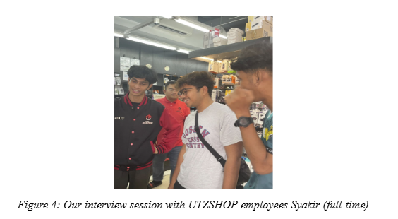

---

## 🔄 Business Process Analysis

### 5 Key Business Process Flowcharts

#### 1. Sales Operation
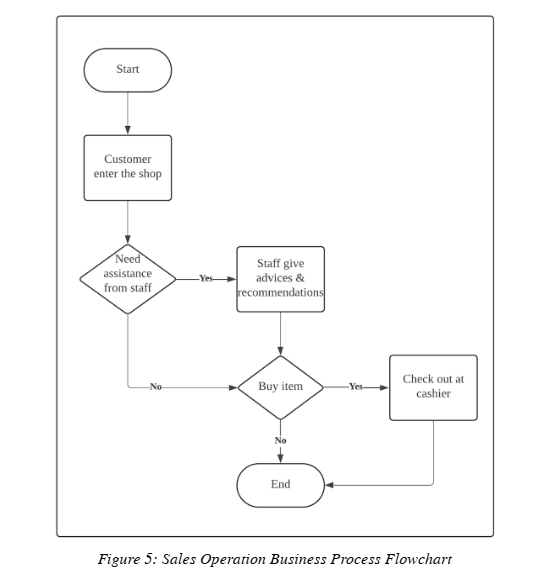

**Process Steps:**
1. Customer enters store
2. Staff provides assistance if needed
3. Customer browses products
4. Customer decides to purchase or leave
5. If purchasing, proceed to checkout with cashier

---

#### 2. Supplier Management
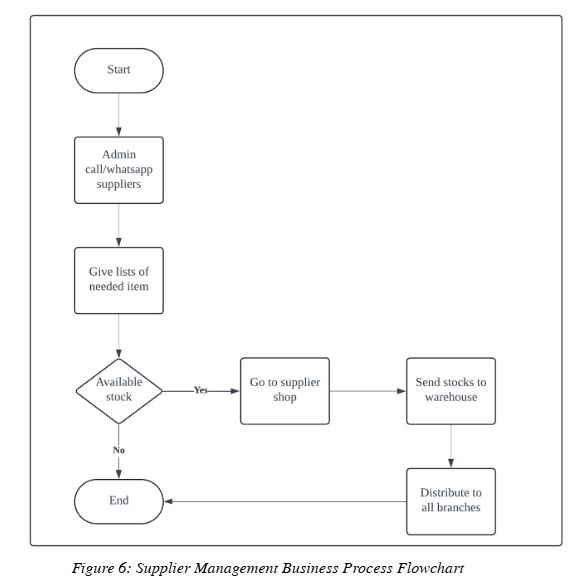

**Process Steps:**
1. Admin checks low stock items
2. Creates list of needed supplies
3. Contacts suppliers (South City or Low Yat)
4. If items available, staff visits supplier for direct purchase
5. Stock sent to warehouse, then distributed to branches

**Suppliers:**
- **South City, Selangor** - Primary supplier
- **Low Yat, Kuala Lumpur** - Secondary supplier

---

#### 3. Marketing Process
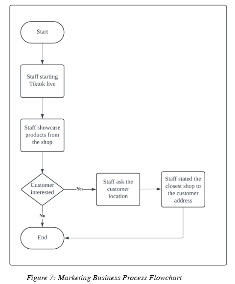

**Process Steps:**
1. Staff assigned to TikTok live streaming
2. Branches take turns hosting live sessions
3. Staff showcases products or provides store tours
4. Engages with viewers through comments
5. Shares nearest branch address based on customer location

---

#### 4. Inventory Management
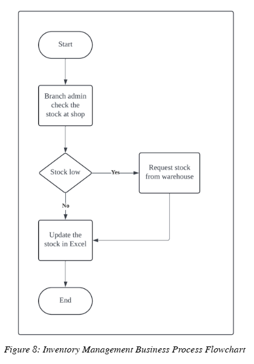

**Process Steps:**
1. Admin inspects stock levels in Excel spreadsheet
2. If stock running low, contact warehouse for more
3. Receive supplies from warehouse
4. Update Excel spreadsheet with new stock

---

#### 5. Customer Feedback
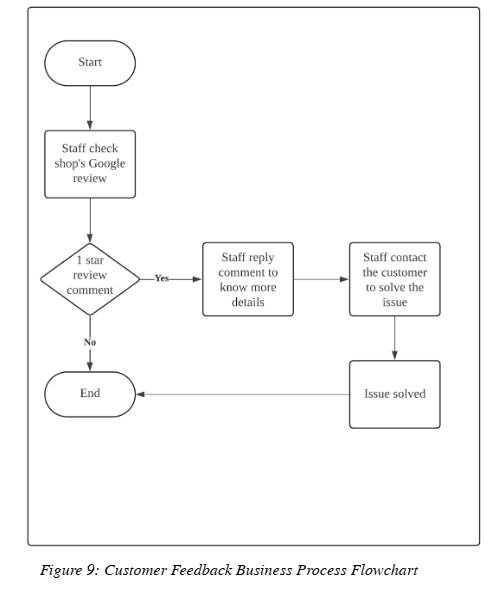

**Process Steps:**
1. Staff checks Google Reviews daily
2. If 1-star review identified, staff responds
3. Requests customer contact information for complex issues
4. Resolves issues (service, product quality, environment)
5. Process completes when customer satisfied

---

## 📈 Porter's Value Chain Analysis

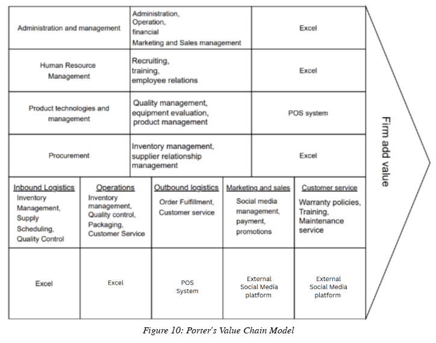

### Primary Activities

| Activity | Description |
|----------|-------------|
| **Inbound Logistics** | Weekly procurement from South City and Low Yat suppliers; quality control inspection at warehouse |
| **Operations** | Inventory management, quality control, packaging, screen protector installation service |
| **Outbound Logistics** | Direct in-store transactions; immediate product pickup |
| **Marketing & Sales** | Social media marketing (TikTok, Instagram, X); POS system for transactions; multiple payment methods (Cash, Credit Card, QR Pay, TnG) |
| **Customer Service** | Warranty plans, maintenance services, staff training, responsive feedback management |

### Support Activities

| Activity | Description |
|----------|-------------|
| **Administration & Management** | Led by Founder Mohd Zailani; strategic planning, direction, budget monitoring |
| **Human Resource Management** | 20 staff per branch; recruitment via Facebook and Maukerja; comprehensive training programs |
| **Product & Technology Management** | POS system maintenance; product trend monitoring; competitive pricing strategy |
| **Procurement** | Weekly restocking; supplier communication via WhatsApp; bulk purchasing |

---

## ⚔️ Porter's Five Forces Analysis

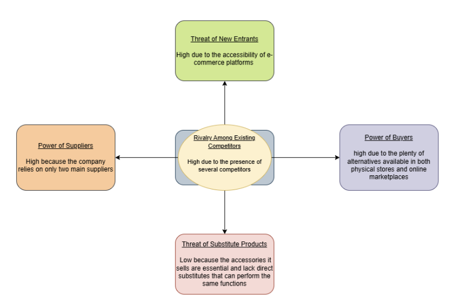

### 1. Rivalry Among Existing Competitors: **HIGH**
- Presence of physical stores and e-commerce platforms (Shopee, Lazada)
- Price wars and aggressive marketing
- Competitors: Al Ikhlas Gadget, Gadgets World 666

### 2. Threat of New Entrants: **HIGH**
- Low barriers to entry via e-commerce platforms
- Easy access to online selling infrastructure
- Challenges: building customer trust, competing with established brands

### 3. Power of Buyers: **HIGH**
- Abundant alternatives online and offline
- Easy price comparison through e-commerce
- High customer expectations for price, quality, and service

### 4. Power of Suppliers: **HIGH**
- Only two main suppliers (South City, Low Yat)
- Limited flexibility in sourcing
- Risk of price increases or supply disruptions

### 5. Threat of Substitute Products: **LOW**
- Accessories are essential (no direct substitutes)
- Risk: technological obsolescence with new phone models
- Mitigation: continuous inventory updates

---

## ⚠️ Problem Statements

From the interview analysis, we identified critical challenges:

| Problem | Impact |
|---------|--------|
| **No Centralized System** | Each branch maintains separate Excel files |
| **Fragmented Data** | Manual consolidation needed for reports (7 branches) |
| **Limited Real-Time Visibility** | Management lacks immediate insight across branches |
| **High Data Loss Risk** | No backup mechanism; vulnerable to corruption/deletion |
| **Poor Scalability** | Adding new branches would worsen inefficiencies |
| **No Automation** | No alerts for low inventory; manual reporting only |

---

## 💡 Proposed Business Solution: UTZSHOP ManageHub

### Solution Overview
**UTZSHOP ManageHub** is a comprehensive web-based application designed to centralize and streamline operations for branch administrators. The platform eliminates fragmented Excel spreadsheets by providing a unified digital system.

### Core Features

| Module | Functionality |
|--------|---------------|
| **Dashboard** | Real-time statistics: attendance, sales, revenue, inventory |
| **Sales Management** | Monthly bar graphs; sales data from POS; customizable reports |
| **Supplier Management** | Centralized supplier database; interactive map; CRUD operations |
| **Restock Management** | Restock trends chart; payment status tracking; dynamic tables |
| **Product Management** | Category bar chart; product pie chart; editable product data |
| **Inventory Tracking** | Branch-specific stock levels; real-time updates |
| **Staff Management** | Staff per branch chart; staff by category chart; employee directory |
| **Attendance Monitoring** | Daily check-in/out; status tracking; editable records |
| **Branch Management** | Centralized branch directory; address and contact info |

### Benefits

| Benefit | Description |
|---------|-------------|
| **Centralized Data** | Single source of truth for all 7 branches |
| **Automated Reporting** | No manual consolidation needed |
| **Real-Time Visibility** | Immediate access to cross-branch data |
| **Data Security** | Reduced risk of loss or corruption |
| **Scalability** | Easy addition of new branches and suppliers |
| **Informed Decisions** | Visual analytics and trends |

---

## 🖥️ System Demonstration

### 1. Sign-In Page
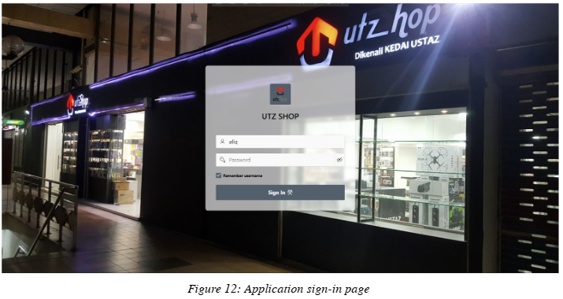

### 2. Home Page Dashboard
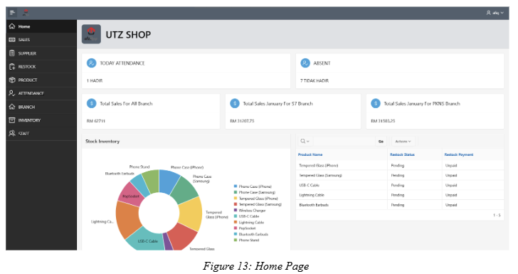

### 3. Navigation Bar
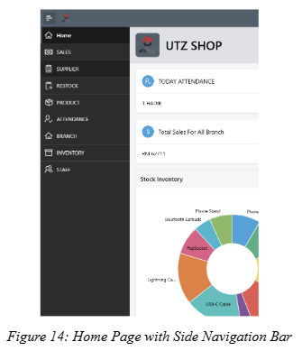

### 4. Sales Page with CRUD
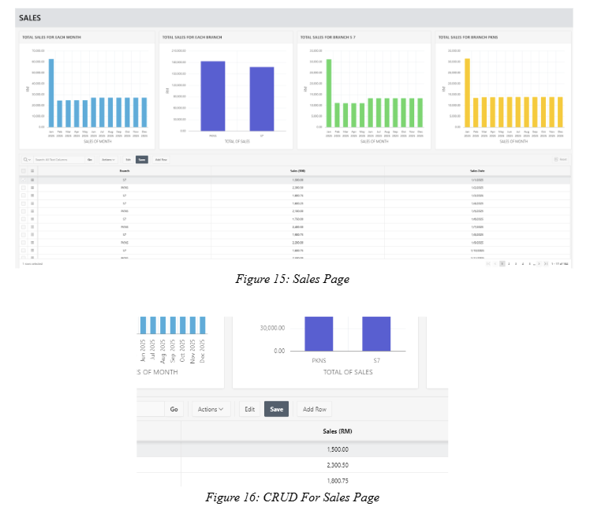

### 5. Supplier Page with Map
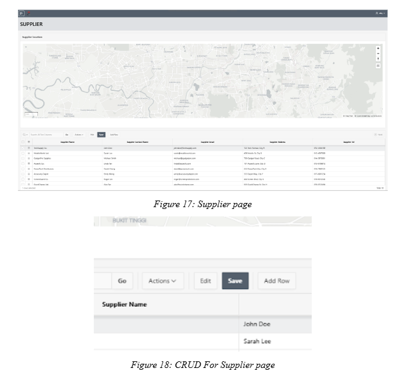

### 6. Restock Page
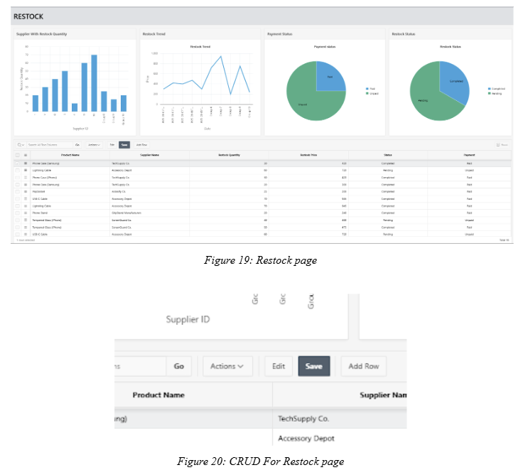

### 7. Product Page
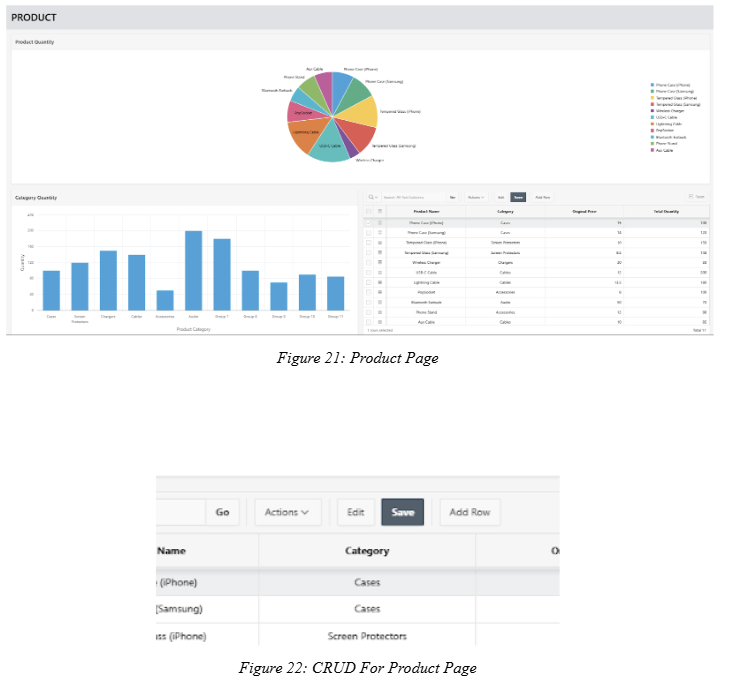

### 8. Attendance Page
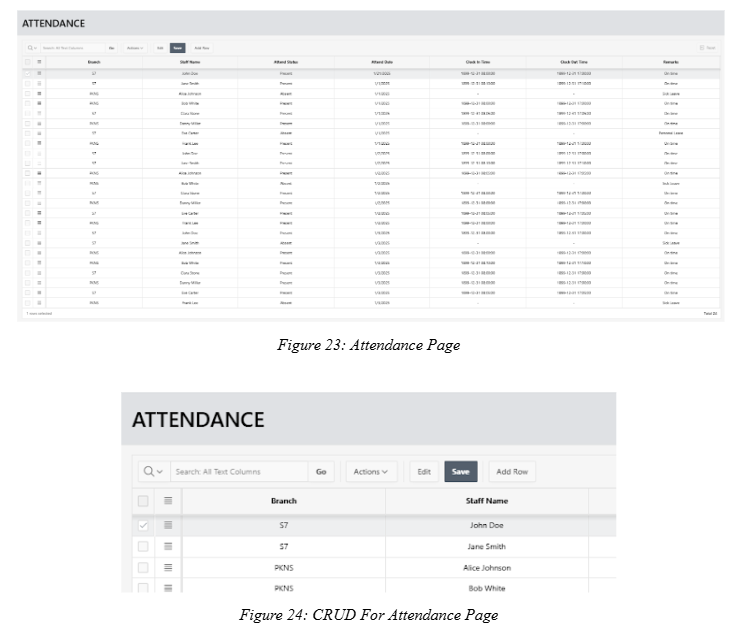

### 9. Branch Page
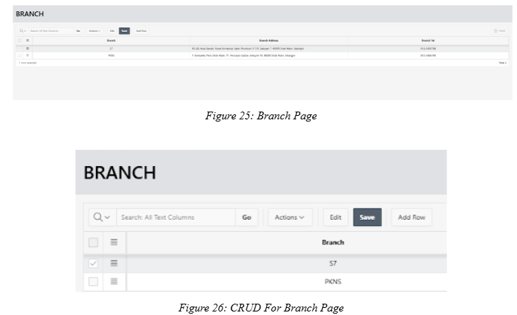

### 10. Inventory Page
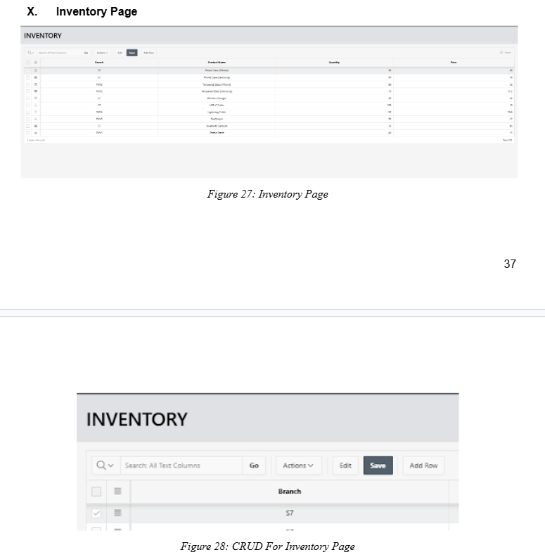

### 11. Staff Page
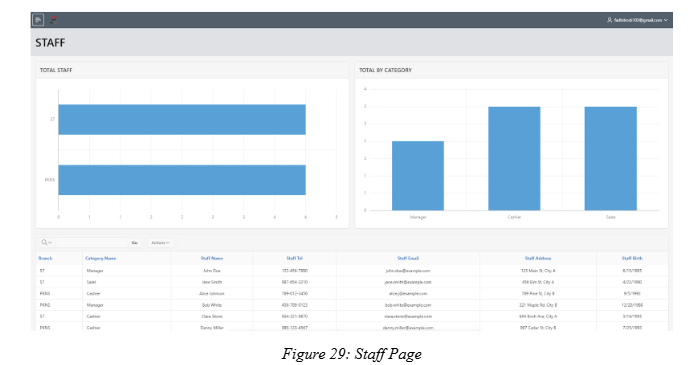

### 12. Logout
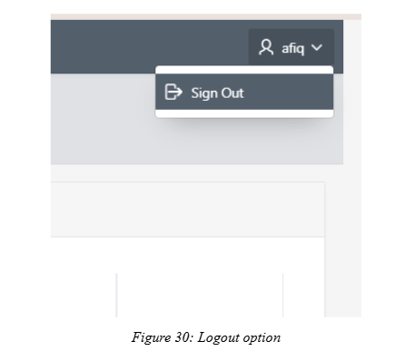

---

## 📚 Lessons Learned

### Key Takeaways from This Project

#### 1. Centralized Data Management is Critical
UTZSHOP's reliance on multiple Excel files across 7 branches creates inefficiencies, inconsistencies, and data loss risks. A centralized system would:
- Improve operational efficiency
- Enhance data quality
- Reduce risk of data loss
- Ensure consistent information across branches

#### 2. Differentiation is Essential in Competitive Markets
With high competition from both physical stores and e-commerce platforms, UTZSHOP must:
- Capitalize on unique strengths
- Emphasize service quality
- Leverage effective marketing strategies
- Stand out through customer experience

#### 3. Strategic Business Planning is Fundamental
A well-defined and regularly updated business plan:
- Acts as a roadmap for operations
- Guides marketing and growth strategies
- Aligns company with objectives
- Prepares for emerging challenges

#### 4. Technology Integration Drives Efficiency
- Excel-only systems cannot scale effectively
- POS integration with centralized databases provides real-time insights
- Social media marketing (TikTok) effectively reaches target audiences
- Customer feedback platforms (Google Reviews) build trust

---

## 👥 Team Members

| Name | Student ID | Role | Contributions |
|------|------------|------|---------------|
| **Muhammad Afiq Bin Azman** | 2024409264 | Project Manager | Oversaw project timeline, coordinated meetings, managed communication, compiled final deliverables |
| **Muhammad Fadhil Bin Rosli** | 2024296816 | Designer/Technical Specialist | Created visual aids, charts, diagrams; formatted presentation; technical tool support |
| **Muhammad Haziq Bin Mohd Azrib** | 2024297614 | Research Analyst | Conducted research, collected data, analyzed information, documented key insights |
| **Muhammad Amir Arsyad Bin Adnan** | 2024294642 | Content Developer | Wrote content, organized structure, edited and proofread final document |

---

## 📁 Repository Structure
